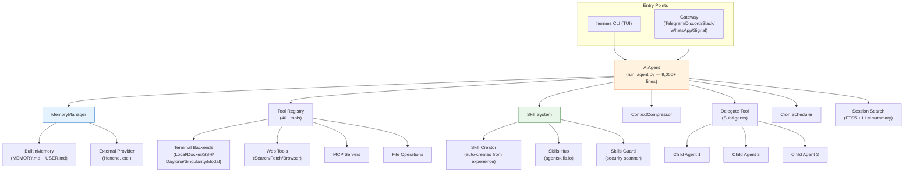
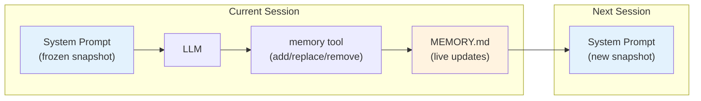
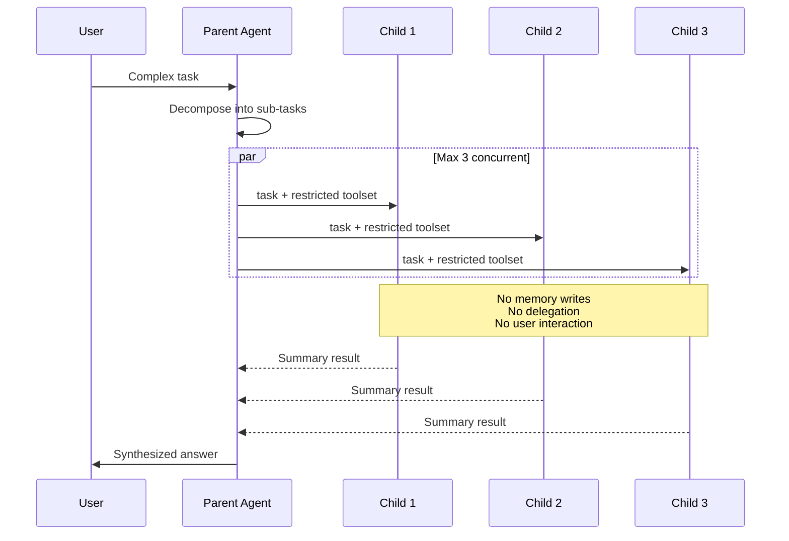

# Hermes Agent: How Nous Research Built a Self-Improving AI Agent

> I dug through 260K lines of Hermes Agent source code to understand what makes a "self-improving agent" actually work. It's more interesting — and more familiar — than you'd expect.

## At a Glance

| Metric | Value |
|--------|-------|
| Stars | 26,130 |
| Forks | 3,416 |
| Language | Python |
| Lines of code | ~260,000 |
| License | MIT |
| Creator | Nous Research (creators of Hermes LLM models) |
| Tagline | "The agent that grows with you" |

If you've used OpenClaw, Hermes Agent will feel familiar. Very familiar. It has the same SOUL.md/MEMORY.md/AGENTS.md file structure, the same skill system, the same gateway architecture, even a `hermes claw migrate` command to import your OpenClaw config. But where it diverges is the most interesting part: the **closed learning loop** — the agent creates skills from experience, improves them during use, and builds an evolving model of who you are.

---

## Architecture



The entire agent loop lives in one file: `run_agent.py` at 9,000+ lines. That's not a typo. Whether this is pragmatic or an architectural debt is debatable — I lean toward the latter, but it clearly works at 26K stars.

---

## The Learning Loop: What Makes Hermes "Self-Improving"

This is the headline feature, so I spent the most time here. The learning loop has three components:

### 1. Autonomous Skill Creation

After completing a complex task, the agent can create a new skill capturing the approach:

```
User: "Set up a monitoring stack with Prometheus and Grafana"
[agent completes the task]
Agent: (internally) "This was complex. I'll create a skill for this."
→ Creates ~/.hermes/skills/prometheus-grafana-setup/SKILL.md
```

The `skill_manager_tool.py` handles creation with six actions: `create`, `edit`, `patch`, `delete`, `write_file`, `remove_file`. Every new skill gets a **security scan** before activation — the same scanner that vets community hub installs runs on agent-authored skills too. That's a detail most frameworks skip.

### 2. Skills Self-Improve During Use

This is the part that interested me most. When the agent uses a skill and discovers a better approach, it can patch the skill in-place:

```python
# From skill_manager_tool.py
def handle_patch(args):
    """Targeted find-and-replace within SKILL.md or any supporting file"""
    # Agent can modify any file in the skill directory
    # Security scan runs AFTER modification
```

The `patch` action does targeted find-and-replace rather than full rewrites. This is smart — it means the agent can fix one section without regenerating the whole skill. And the post-edit security scan catches any injections the LLM might accidentally introduce.

### 3. Memory Nudges

The agent periodically nudges itself to persist knowledge. The `BuiltinMemoryProvider` wraps MEMORY.md and USER.md, injecting them as a **frozen snapshot** into the system prompt at session start:

```python
# From builtin_memory_provider.py
def system_prompt_block(self) -> str:
    """Uses the frozen snapshot captured at load time.
    This ensures the system prompt stays stable throughout a session
    (preserving the prompt cache), even though the live entries
    may change via tool calls."""
```

This is a clever cache optimization: the system prompt never changes mid-session (preserving prefix caching), but the on-disk files DO get updated immediately. Next session sees the fresh data.



---

## SubAgent Delegation

Hermes's delegation system is more restrictive than DeerFlow's, and I think that's the right call.

```python
# From delegate_tool.py
DELEGATE_BLOCKED_TOOLS = frozenset([
    "delegate_task",   # no recursive delegation
    "clarify",         # no user interaction
    "memory",          # no writes to shared MEMORY.md
    "send_message",    # no cross-platform side effects
    "execute_code",    # children should reason step-by-step
])

MAX_CONCURRENT_CHILDREN = 3
MAX_DEPTH = 2  # parent (0) -> child (1) -> grandchild rejected
```

Key design decisions:

1. **No recursive delegation** — children can't spawn grandchildren (depth limit = 2, but `delegate_task` is blocked so effective depth = 1)
2. **No memory writes** — children can't corrupt shared MEMORY.md
3. **No user interaction** — children can't ask clarifying questions
4. **No code execution** — children "should reason step-by-step, not write scripts"



The no-memory-writes constraint is worth calling out. In DeerFlow, subagents share the parent's thread state. In Hermes, they're fully isolated. This prevents a class of bugs where two children simultaneously try to update MEMORY.md, but it also means children can't benefit from each other's discoveries within a single turn.

---

## Context Compression

The `ContextCompressor` is probably the best-engineered module in the codebase. It uses a five-step algorithm:

1. **Prune old tool results** — cheap pre-pass, no LLM call. Old tool outputs get replaced with `[Old tool output cleared to save context space]`
2. **Protect the head** — system prompt + first exchange are never summarized
3. **Protect the tail** — most recent ~20K tokens are kept verbatim
4. **Summarize the middle** — uses a structured template: Goal, Progress, Decisions, Files, Next Steps
5. **Iterative updates** — on subsequent compactions, the previous summary gets refined rather than regenerated

```python
SUMMARY_PREFIX = (
    "[CONTEXT COMPACTION] Earlier turns in this conversation were compacted "
    "to save context space. The summary below describes work that was "
    "already completed..."
)
```

The structured summary template is the key improvement over naive compression. Instead of "summarize everything," it asks the model to specifically track goals, decisions made, and files modified. This makes post-compaction continuity much smoother.

---

## Session Search: Cross-Session Recall

This is where Hermes gets genuinely innovative. Most agent frameworks treat each session as a clean slate with only MEMORY.md for continuity. Hermes stores all sessions in SQLite with FTS5 full-text search:

```python
# From session_search_tool.py
"""
Flow:
  1. FTS5 search finds matching messages ranked by relevance
  2. Groups by session, takes the top N unique sessions (default 3)
  3. Loads each session's conversation, truncates to ~100k chars
  4. Sends to Gemini Flash with a focused summarization prompt
  5. Returns per-session summaries with metadata
"""
```

When you ask "what did I work on last week?", it doesn't just grep MEMORY.md — it searches actual conversation transcripts, finds the most relevant sessions, and uses a cheap model (Gemini Flash) to summarize them. The main model's context stays clean.

---

## Six Terminal Backends

This is the operational flexibility that makes Hermes more than a toy:

| Backend | What It Is | Best For |
|---------|-----------|---------|
| Local | Direct shell access | Development |
| Docker | Containerized execution | Isolation |
| SSH | Remote machine access | VPS/servers |
| Daytona | Serverless dev environments | Hibernate when idle |
| Singularity | HPC containers | GPU clusters |
| Modal | Serverless compute | Pay-per-second |

Daytona and Modal are the interesting ones — they offer **serverless persistence**. Your agent's environment hibernates when idle and wakes on demand. If your agent runs 2 hours/day, you pay for 2 hours, not 24.

---

## OpenClaw Migration: The Elephant in the Room

Hermes ships with a first-class OpenClaw migration tool:

```bash
hermes claw migrate              # Interactive migration
hermes claw migrate --dry-run    # Preview what would change
hermes claw migrate --preset user-data  # Only data, no secrets
```

It imports: SOUL.md, MEMORY.md, USER.md, skills, command allowlists, messaging configs, API keys, TTS assets, and workspace instructions.

What this tells me: Hermes isn't just inspired by OpenClaw — it's positioning as the next step. The migration tool is a growth hack: make switching easy, and you inherit OpenClaw's user base.

---

## Memory Threat Detection

The memory tool includes inline threat scanning — checking for prompt injections in content that gets injected into the system prompt:

```python
_MEMORY_THREAT_PATTERNS = [
    # Patterns that detect injection attempts in memory entries
    # Prevents adversarial content from persisting into system prompts
]
```

This is the right instinct. Memory is a persistence vector for prompt injection: if an attacker can get malicious text into MEMORY.md (via a poisoned web page the agent reads, for example), it affects every future session. Most frameworks don't scan memory writes at all.

---

## What They Got Right

1. **The learning loop is real, not vaporware.** Skills get created, patched, and improved in-place. Security scanning on agent-authored skills is a nice touch.

2. **Frozen memory snapshots for prompt cache stability.** Writes go to disk immediately but don't break the prefix cache. Simple optimization with real cost savings.

3. **Session search with LLM summarization.** FTS5 + Gemini Flash for cross-session recall is clever — keeps the main model's context clean while giving genuine long-term memory.

---

## What I'd Push Back On

1. **9,000 lines in one file.** `run_agent.py` is the entire agent loop in a single file. At 26K stars, this is technical debt that will bite them. Every PR touches this file, every merge conflict happens here. DeerFlow's middleware chain is a better architecture for extensibility.

2. **"No code execution" for children.** Blocking `execute_code` in subagents seems overly conservative. The stated reason is "children should reason step-by-step" but in practice this means children can't run tests, check outputs, or validate their work. I'd make this configurable.

3. **Memory provider limit of one.** Only one external memory provider at a time. The code explicitly rejects a second provider. This seems like a premature constraint — what if you want Honcho for user modeling AND a vector DB for semantic search?

4. **No cost budgets.** Same gap as DeerFlow. Session insights track costs retroactively, but there's no way to set "stop after $X." For an agent that can run on Modal with serverless compute, this is a real risk.

5. **OpenClaw migration as a feature.** This is strategic, not technical feedback. But explicitly building a migration tool from a specific competitor signals that you're playing catch-up. Better to focus on features that make migration happen organically.

---

## Hermes vs DeerFlow vs OpenClaw

| Feature | Hermes Agent | DeerFlow 2.0 | OpenClaw |
|---------|-------------|-------------|----------|
| Language | Python | Python + TS | Node.js/TS |
| Agent loop | Single 9K-line file | LangGraph + middleware | Event-driven |
| Learning loop | Skills auto-created + self-improved | No | Skills manual only |
| Memory | MEMORY.md + USER.md (frozen snapshot) | JSON (hierarchical, confidence scores) | MEMORY.md (markdown) |
| Session recall | FTS5 + LLM summarization | No cross-session search | Session transcripts |
| SubAgent depth | 1 (blocked by tool restriction) | 1 (no self-delegation) | Configurable |
| SubAgent isolation | Fully isolated (no shared memory) | Shares parent thread state | Isolated |
| Terminal backends | 6 (Local/Docker/SSH/Daytona/Singularity/Modal) | 2 (Local/Docker) | 1 (Local) |
| IM channels | 6 (Telegram/Discord/Slack/WhatsApp/Signal/Email) | 3 (Feishu/Slack/Telegram) | 7+ |
| Cron | Built-in with platform delivery | No | Built-in |
| Security | Memory threat scanning + skill security guard | Advisory notice only | Command approval |

---

## Lessons Worth Stealing

**If your agent writes to a system prompt, scan those writes.** Hermes scans memory entries for prompt injection before persisting them. Most frameworks blindly inject whatever the LLM decides to remember. That's a persistence attack vector.

**Freeze your system prompt within a session.** Hermes writes to disk immediately but doesn't update the running system prompt. This preserves the prefix cache (real cost savings) and prevents mid-session instability. Simple pattern, easy to implement, measurable impact.

**Store sessions, not just memories.** MEMORY.md is the agent's curated summary. But full session transcripts in SQLite with FTS5 give you recall over things the agent didn't think to memorize. These are complementary, not redundant.

---

*Part of [awesome-ai-anatomy](https://github.com/NeuZhou/awesome-ai-anatomy) — source-level teardowns of how production AI systems actually work.*
