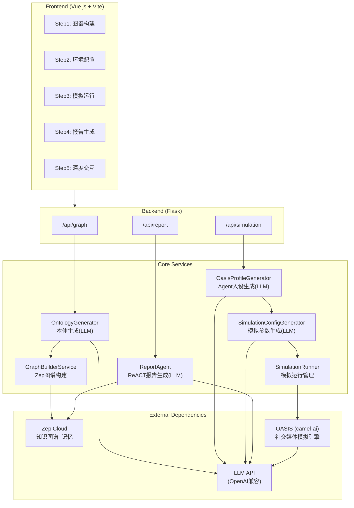
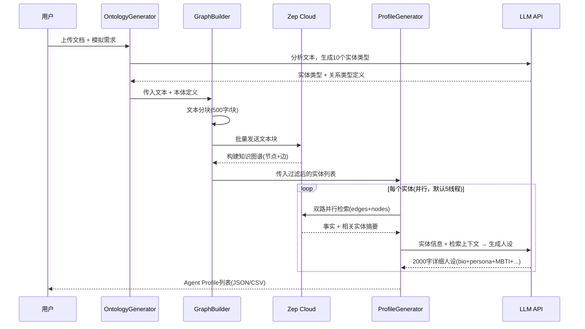
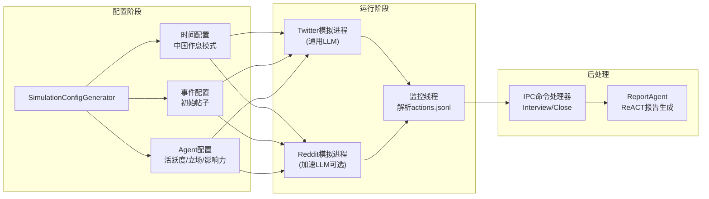

# MiroFish: 50K Stars的"群体智能预测引擎"拆开一看，是个LLM社交模拟器套了层高级壳

> 我本以为会看到某种精巧的群体智能算法——粒子群、蚁群、或者至少是个进化计算变体。结果clone下来一看，核心预测能力全靠LLM角色扮演+社交媒体模拟。这个发现让我重新审视了"群体智能"这四个字在2026年的含义。

## At a Glance

| Metric | Value |
|--------|-------|
| Stars | 50,223 |
| Forks | 7,385 |
| Language | Python (后端) + Vue.js (前端) |
| Framework | Flask + OASIS (camel-ai) + Zep Cloud |
| Lines of Code | ~38,800 (Python 20,025 + Vue/JS 18,790) |
| License | AGPL-3.0 |
| First Commit | 2025-11-26 (仓库创建) |
| Latest Commit | 2026-04-02 |

MiroFish做的事情说白了：你给它一份文档（新闻报道、政策草案、小说章节），它用LLM提取里面的人物和组织，给每个角色生成一份"社交媒体人设"，然后把这些LLM驱动的Agent扔进模拟的Twitter/Reddit环境里互动N轮，最后把互动记录整理成一份"未来预测报告"。

---

## Architecture



MiroFish的架构分三层看：最外层是一个Vue.js的步骤向导界面，用Vite打包，中间层是Flask API，底层是一堆LLM调用链。

让我意外的是，这个项目的"核心引擎"并不存在于MiroFish自己的代码里。真正做Agent社交模拟的是OASIS（camel-ai团队的开源项目），MiroFish做的是在OASIS之上包装了一层"从文档到模拟"的自动化流程。整个pipeline里有至少5个独立的LLM调用点——本体生成、人设生成、模拟配置生成、模拟中Agent的行为决策、报告生成——每一步都是一次或多次LLM API请求。这意味着跑一次完整模拟的API费用不会低。

文件结构倒是清晰，`backend/app/services/`下面每个文件负责pipeline的一个阶段，`backend/scripts/`放的是OASIS模拟的启动脚本。前端和后端完全分离，通过REST API通信。

**Files to reference:**
- `backend/run.py` — Flask应用入口
- `backend/app/services/graph_builder.py` — Zep知识图谱构建
- `backend/app/services/simulation_runner.py` — OASIS模拟运行管理（最长的文件，700+行）
- `backend/app/services/report_agent.py` — ReACT模式报告生成（最复杂的文件，1400+行）
- `backend/scripts/run_parallel_simulation.py` — 双平台并行模拟脚本（900+行）

---

## Core Innovation

MiroFish的核心卖点不是算法层面的创新，而是**把LLM驱动的多Agent社交模拟包装成了一个端到端的"预测"产品**。它的工程贡献在于：把"上传文档→提取实体→生成人设→配置模拟→运行模拟→生成报告"这条原本需要大量手动操作的链路给串起来了。

最有意思的设计是人设生成阶段的"二次检索"机制：

```python
# From backend/app/services/oasis_profile_generator.py:283
def _search_zep_for_entity(self, entity: EntityNode) -> Dict[str, Any]:
    """
    使用Zep图谱混合搜索功能获取实体相关的丰富信息
    """
    comprehensive_query = t('progress.zepSearchQuery', name=entity_name)
    
    def search_edges():
        """搜索边（事实/关系）- 带重试机制"""
        return self.zep_client.graph.search(
            query=comprehensive_query,
            graph_id=self.graph_id,
            limit=30,
            scope="edges",
            reranker="rrf"
        )
    
    def search_nodes():
        """搜索节点（实体摘要）- 带重试机制"""
        return self.zep_client.graph.search(
            query=comprehensive_query,
            graph_id=self.graph_id,
            limit=20,
            scope="nodes",
            reranker="rrf"
        )
    
    # 并行执行edges和nodes搜索
    with concurrent.futures.ThreadPoolExecutor(max_workers=2) as executor:
        edge_future = executor.submit(search_edges)
        node_future = executor.submit(search_nodes)
```

每个实体生成人设之前，先用Zep的图谱搜索API并行查询相关的"边"（事实关系）和"节点"（实体摘要），把检索到的上下文塞进LLM prompt里。这让生成的人设不是凭空编的，而是有图谱数据支撑的。这个思路挺实用。

另一个值得注意的是ReportAgent的ReACT循环设计——它要求LLM每个章节至少调用3次工具、最多5次，而且会跟踪哪些工具还没用过并主动推荐：

```python
# From backend/app/services/report_agent.py:695
# 构建未使用工具提示
unused_tools = all_tools - used_tools
unused_hint = ""
if unused_tools and tool_calls_count < self.MAX_TOOL_CALLS_PER_SECTION:
    unused_hint = REACT_UNUSED_TOOLS_HINT.format(
        unused_list="、".join(unused_tools)
    )
```

这个"强制使用多种工具"的策略比简单的ReACT循环多了一层人为约束——防止LLM只用一种检索方式就草草出报告。

---

## How It Actually Works

### 从文档到Agent：人设生成pipeline



这个pipeline有几个设计决策值得说说：

本体生成阶段硬编码了"必须正好10个实体类型，最后2个必须是Person和Organization兜底"的规则。这个看起来死板，但考虑到Zep API限制最多10个自定义类型，这其实是在API约束下做的务实选择。

人设生成区分了"个人实体"和"群体/机构实体"两种prompt模板。个人实体要求LLM生成年龄、性别、MBTI、口头禅这些细节；机构实体则要求生成"账号定位、发言风格、禁忌话题"。这个区分是必要的——一个大学官方账号不应该有MBTI性格。

生成过程支持实时写入文件（每生成一个就保存一次），这在生成20+个Agent时能让前端实时展示进度，但代价是频繁的文件I/O。

### 双平台并行模拟



模拟运行的方式是：Flask后端启动一个子进程跑`run_parallel_simulation.py`，这个脚本用`asyncio.gather`并行启动Twitter和Reddit两个平台的模拟。每个平台各自维护一个SQLite数据库记录Agent的所有动作。

时间模拟的设计硬编码了中国人的作息模式（凌晨0-5点活跃度0.05，晚间19-22点活跃度1.5）。虽然README声称支持"预测万物"，但这个默认配置显然是为中文舆情场景定制的。

有个有趣的细节：模拟脚本在Windows上会monkey-patch内置的`open()`函数，强制所有未指定编码的文件操作使用UTF-8：

```python
# From backend/scripts/run_parallel_simulation.py:30
import builtins
_original_open = builtins.open

def _utf8_open(file, mode='r', buffering=-1, encoding=None, errors=None, 
               newline=None, closefd=True, opener=None):
    if encoding is None and 'b' not in mode:
        encoding = 'utf-8'
    return _original_open(file, mode, buffering, encoding, errors, 
                          newline, closefd, opener)

builtins.open = _utf8_open
```

这是个粗暴但有效的解法，说明他们在Windows上被编码问题折腾过，而且OASIS库本身没有正确处理编码。

### Interview系统：模拟后的Agent对话

模拟完成后，MiroFish不会关闭模拟环境，而是进入一个"等待命令模式"——通过文件系统IPC（`ipc_commands/`和`ipc_responses/`目录下的JSON文件）接收采访请求。前端可以向任意Agent提问，Agent在两个平台的上下文中分别回答。

这个IPC设计很「朴素」——不是用WebSocket或消息队列，而是轮询JSON文件。每0.5秒检查一次命令目录。在小规模部署下够用，但如果需要高频交互就会成为瓶颈。

---

## The Verdict

MiroFish做了一件在工程上有价值的事：它把"LLM多Agent社交模拟"从学术论文的实验代码变成了一个可以交互操作的Web产品。5步向导的用户体验设计降低了门槛，从上传文档到看到报告全程自动化，不需要写代码。ReportAgent的ReACT模式和多工具强制使用策略让生成的报告有数据支撑而不是纯编。双平台并行模拟和模拟后Interview的设计也体现了产品思维。

但"群体智能引擎"这个定位是夸大了。这个项目里没有群体智能算法——没有粒子群、没有蚁群、没有进化计算、没有任何涌现机制的数学建模。所谓的"群体智能"就是"多个LLM Agent在模拟社交平台上按照各自人设发帖和互动"。这里面的"智能"全部来自底层LLM的能力，Agent之间的"涌现"本质上是LLM读到了其他Agent的帖子后做出的角色扮演式回应。OASIS框架本身（来自camel-ai团队）才是真正做模拟引擎的，MiroFish的自有代码只是做了编排和包装。

代码质量参差不齐。`report_agent.py`一个文件1400+行，把日志类、数据类、prompt常量、ReACT循环逻辑、报告管理器全塞在一起。`simulation_runner.py`有大量类方法，状态管理复杂。相比之下，`ontology_generator.py`和`graph_builder.py`写得干净得多。整体上没有测试文件，`backend/scripts/test_profile_format.py`从文件名看是唯一的"测试"，但实际上只是个格式验证脚本。

关于50K stars的月增长速度：这个项目2025年11月才创建，到2026年4月就50K stars，但只有1个commit（在我clone的浅层历史里）。代码仓库里只有60个源码文件，总共不到4万行，其中前端Vue组件和后端Python各占一半。这个代码量和50K stars之间的比例，在我见过的开源项目里属于异常值。不是说star数一定有水分，但通常50K stars对应的项目会有更深厚的代码积累和社区贡献。这可能说明star增长更多来自概念层面的吸引力（"预测万物"这个愿景确实抓眼球）而不是技术实现的壁垒。

关于预测准确性：MiroFish在README里声称能做"Financial Prediction"和"Political News Prediction"，但代码里没有任何预测准确率的评估逻辑，没有benchmark，也没有与真实事件的回测对比。目前展示的demo是"武大舆情模拟"和"红楼梦结局推演"——这更像是创意型应用而不是严肃预测工具。把LLM角色扮演的模拟结果等同于"预测"是一个需要大量验证的声明，而这个验证在代码里完全缺失。

我会用这个项目吗？如果目标是做舆情"推演"（注意不是"预测"），探索"如果发生X事件，各方可能怎么反应"，那MiroFish提供了一个不错的框架。但我不会用它来做需要置信度的决策支持——因为它的输出本质上是LLM的创意写作，不是统计推断。

---

## Cross-Project Comparison

| Feature | MiroFish | Deer-Flow | Claude Code |
|---------|----------|-----------|-------------|
| 语言 | Python + Vue.js | Python | TypeScript |
| 核心能力 | LLM多Agent社交模拟 | Deep Research多Agent协作 | AI辅助编程 |
| Agent数量 | 数十~数百个并行 | 5-6个固定角色 | 单Agent |
| LLM调用密度 | 极高(每个Agent每轮1次) | 高(研究流程中多次) | 高(每次交互) |
| 外部依赖 | Zep Cloud + OASIS | LangGraph | Anthropic API |
| 自有/借用核心 | OASIS(借用) | LangGraph(借用) | 自研 |
| 测试覆盖 | 无 | 有 | 有 |
| 可复现性 | 低(LLM输出随机) | 中 | 高 |

MiroFish在这个比较中的独特位置是：它可能是唯一一个让LLM Agent"在模拟社交平台上自由互动"的产品化项目。Deer-Flow的Agent是按流程协作完成研究任务，Claude Code的Agent是在编程场景下辅助开发，而MiroFish让Agent们像真人一样发帖、评论、转发、关注。这个方向本身有研究价值，问题在于从"模拟"到"预测"的跳跃缺乏方法论支撑。

---

## Stuff Worth Stealing

**1. 双平台并行模拟的日志架构**

每个平台的动作日志写入独立的`actions.jsonl`文件，监控线程通过文件位置追踪增量读取。这种设计避免了跨进程共享状态的复杂性：

```python
# From backend/app/services/simulation_runner.py:317
# 读取 Twitter 动作日志
if os.path.exists(twitter_actions_log):
    twitter_position = cls._read_action_log(
        twitter_actions_log, twitter_position, state, "twitter"
    )
```

简单、可靠、可恢复。如果模拟中途崩溃，重启后可以从上次的文件位置继续读取。

**2. 强制多工具检索的ReACT策略**

ReportAgent不光实现了ReACT循环，还加了"最少3次工具调用"和"未使用工具提醒"的约束。这种"强制agent探索多种信息源"的思路可以直接搬到任何RAG+Agent系统里：

```python
# From backend/app/services/report_agent.py:636
if tool_calls_count < min_tool_calls:
    unused_tools = all_tools - used_tools
    unused_hint = (
        f"（这些工具还未使用，推荐用一下他们: {', '.join(unused_tools)}）"
    ) if unused_tools else ""
```

**3. 实体到Agent的类型区分策略**

`OasisProfileGenerator`里维护了`INDIVIDUAL_ENTITY_TYPES`和`GROUP_ENTITY_TYPES`两个列表，不同类型使用不同的prompt模板生成人设。这个"先分类、再分别处理"的模式在任何需要批量处理异构数据的LLM应用里都适用。

---

## Hooks & Easter Eggs

项目的中文README标题是"简洁通用的群体智能引擎，预测万物"，但代码中事件配置的默认示例用的是高校舆情场景（`Student`、`Professor`、`University`）。默认的Agent活跃时间模式也完全按照中国时区的作息设计。这说明虽然定位是"通用"，但实际开发和测试都围绕着中文舆情场景。

值得注意的是Acknowledgments里提到"MiroFish has received strategic support and incubation from Shanda Group"（盛大集团）。一个有盛大背景的项目做舆论模拟预测工具——从商业角度这个方向不难理解。

代码里的monkey-patch `builtins.open`堪称Windows兼容性的"核武器"——粗暴但有效，说明团队在实际部署中踩过不少Windows下的编码坑。

---

## Verification Log

<details>
<summary>Fact-check log (click to expand)</summary>

| Claim | Verification Method | Result |
|-------|-------------------|--------|
| 50,223 stars | GitHub API `stargazers_count` | ✅ Verified (2026-04-06) |
| 7,385 forks | GitHub API `forks_count` | ✅ Verified |
| Python + Vue.js | 仓库文件结构 | ✅ Verified |
| ~38,800 LOC | PowerShell `Measure-Object -Line` on *.py + *.vue + *.js | ✅ Verified (Python 20,025 + Vue/JS 18,790) |
| AGPL-3.0 License | `LICENSE` file header | ✅ Verified |
| Created 2025-11-26 | GitHub API `created_at` | ✅ Verified |
| 60 source files | `Get-ChildItem -Include *.py,*.vue,*.js \| Measure-Object` | ✅ Verified |
| OASIS (camel-oasis==0.2.5) | `requirements.txt` | ✅ Verified |
| Zep Cloud dependency | `requirements.txt` (zep-cloud==3.13.0) + `config.py` | ✅ Verified |
| `backend/app/services/report_agent.py` 存在 | 文件读取 | ✅ Verified |
| `backend/scripts/run_parallel_simulation.py` 存在 | 文件读取 | ✅ Verified |
| monkey-patch `builtins.open` | `run_parallel_simulation.py:30` | ✅ Verified |
| 无测试文件 | 仓库文件结构 | ✅ Verified (仅test_profile_format.py) |
| 盛大集团支持 | `README.md` Acknowledgments | ✅ Verified |
| 双平台并行模拟 | `run_parallel_simulation.py` + `asyncio.gather` | ✅ Verified |
| IPC通过文件系统 | `ParallelIPCHandler` class | ✅ Verified |

</details>

---

*Part of [awesome-ai-anatomy](https://github.com/NeuZhou/awesome-ai-anatomy) — source-level teardowns of how production AI systems actually work.*
